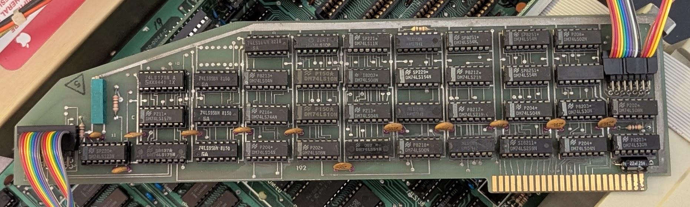
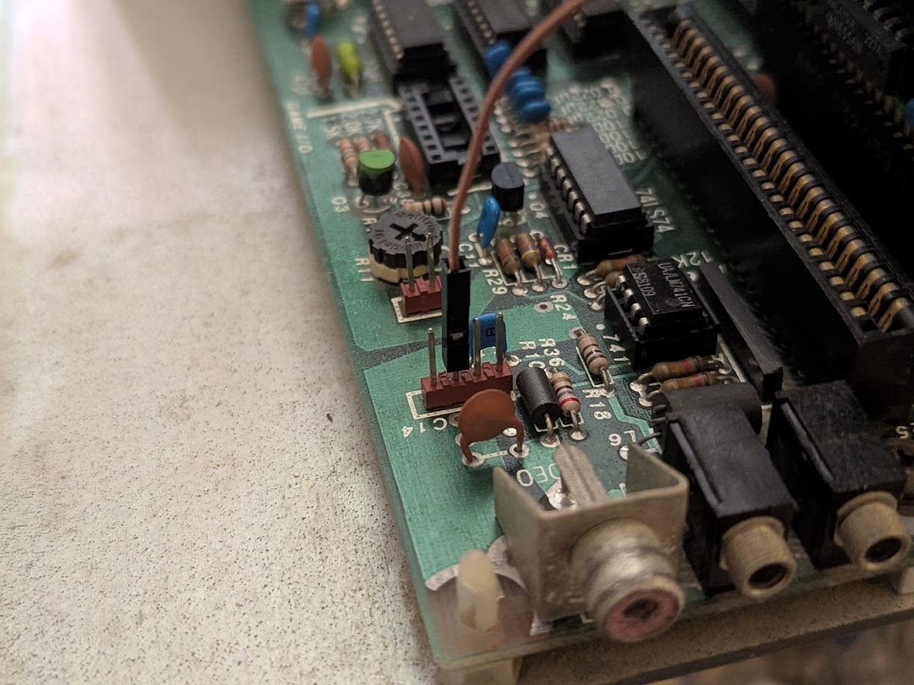
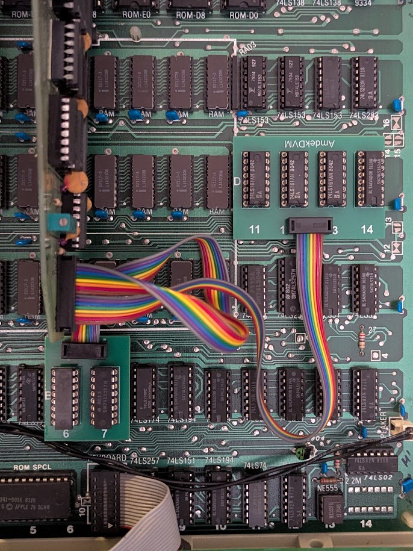

# Amdek DVM Clone

The Amdek DVM allowed RGB digital monitors to be connected to Apple II
computers (which normally output composite video).

This project is a reverse-engineered version of this card.

It uses readily-available TTL logic chips, with no programmable devices at
all.

*Note: The photo shows an original DVM card since I have not fabricated my design*

[Schematic](AmdekDVM.pdf)

[Bill of Materials](AmdekDVM.csv)

[Fab files](fab/AmdekDVM-Rev1.zip)

[Fab files for daughterboard](AmdekDaughterBoard/fab/AmdekDaughterBoard-Rev1.zip)

## Fabrication Notes

The main board is 280mm x 76mm (11" x 3"). It is a simple 2-layer board. It
has an edge connector on the bottom, and you may want to have it gold plated,
but this isn't strictly necessary. No edge bevel is required but it may make
it easier to insert into the connectors on the Apple II (or you could add
one with a file).

The daughterboard is 38mm x 87mm (1.5" x 3.435"). It is a simple 2-layer board
and could even be reduced down to a 1-layer design if you have access to such
a fab process.

## Assembly Notes

RV2 is actually a fixed resistor, 2K. Solder it from pin 1 to pin 3.

C3-C13 are just bypass capacitors and could easily be subbed out with 0.1uF.

C14-C23 are not stuffed on the original board, but it would be harmless
to place 0.1uF capacitors here.

The daughterboard (actually two separate boards, see the photos below) should
have machine-pin sockets installed. To allow them to be plugged into the Apple
II motherboard, solder additional socket pins (harvested from spare sockets)
to the ends of the pins protruding from the other side of the board. Alignment
is critical so that the pins will plug into the sockets on the Apple II.

The daughterboard can be assembled with regular 0.1" headers and 8-pin IDC
plugs, or you can use a combined part like the CA2308PA10Z. The cable is
split exactly in half, with the first 8 pins going to the 4-chip daughterboard
and the second 8 pins going to the 2-chip daughterboard (with wire 9 tied
to pin 1 of this daughterboard).

## Cables

To build this card, you will need a video output cable wired as follows. Plug
it into J2 (nearest the edge connector).

| Pin | Description |
|-----|-------------|
| 1   | Red output |
| 2   | Blue output |
| 3   | Green output |
| 4   | Horizontal sync (positive) |
| 5   | Horizontal sync (negative) |
| 6   | Vertical sync (positive) |
| 7   | Vertical sync (negative) |
| 8   | No connect |
| 9   | Ground |
| 10  | No connect |
| 11  | Apple II text - connect to Apple II header K14 pin 2 |
| 12  | Horizontal sync from 80-column card |
| 13  | Video signal from 80-column card |
| 14  | Vertical sync from 80-column card |

Pin 11 of this cable should be wired to the Apple II video header. On my
Apple II+, it looks like this.

If you want to connect the DVM to a CGA-compatible monitor, wire it up as
follows:

| Amdek Pin | CGA Pin | Description |
|-----------|---------|-------------|
| 1         |  3      | Red output  |
| 2         |  5      | Blue output |
| 3         |  4      | Green output |
| 4         |  8      | Horizontal sync (positive) |
| 6         |  9      | Vertical sync (positive) |
| 9         |  1      | Ground |

If you have an 80-column card, you can wire pins 12-14 to that card as
appropriate.

You will also need a cable connected to J1 (furthest from the edge connector)
wired to two daughterboards. The daughterboards act as interposers, tapping
various signals on the Apple II motherboard.

* One daughterboard sits on motherboard positions D11, D12, D13, and D14,
hosting the four 74LS161 chips that the Apple II uses to generate the video
timing signals. It intercepts three horizontal counter bits and five vertical
counter bits.

* The other daughterboard sits on motherboard positions B6 and B7, hosting
two 74LS257 chips. This intercepts the eight digital video bits before
they go through encoding to composite video.

## Adjustments

When you install the card, ensure you get video out of your Apple II, then
adjust RV1 until you get stable pixels.
